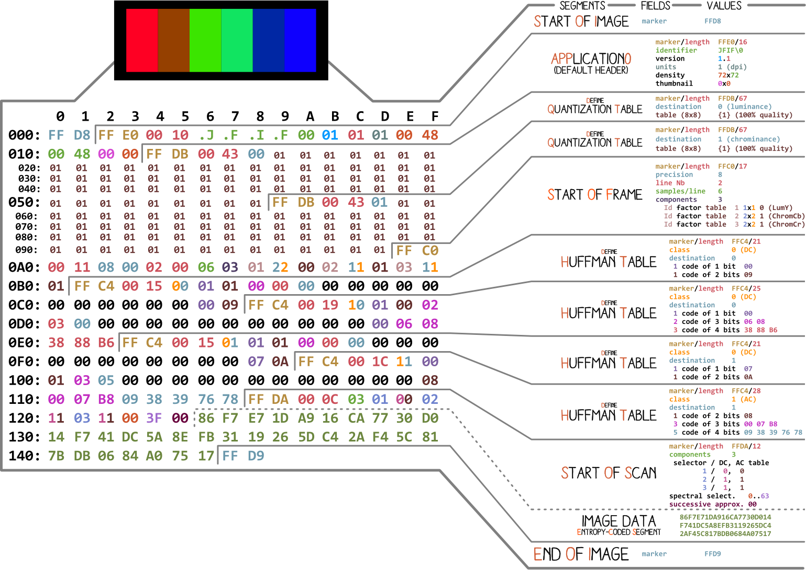
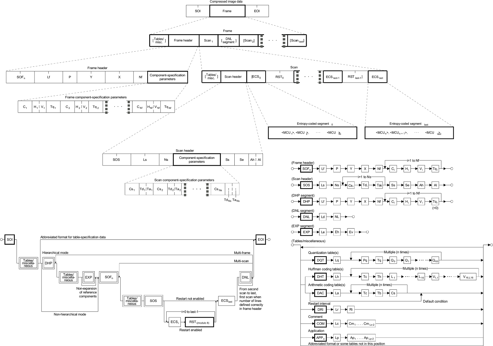

# [JPEG](https://en.wikipedia.org/wiki/JPEG) [JAY-peg]

JPEG (Joint Photographic Experts Group) is the image encoding,
JFIF (JPEG File Interchange Format) is the file format storage.

# References

Official specifications
- [JPEG File Interchange Format v1.02, Sept 1. 1992](https://www.w3.org/Graphics/JPEG/jfif3.pdf)
- [ITU T.81 | ISO IEC 10918-1](https://www.w3.org/Graphics/JPEG/itu-t81.pdf): *Information Technology - digital Compression And Coding of Continuous-tone Still Images - requirements And Guidelines*

sources:
- [libjpeg](http://libjpeg.sourceforge.net/): list: jdmarker.c#L21 , handling: jdmarker.c#L1113
  - [libjpeg-turbo](https://github.com/libjpeg-turbo/libjpeg-turbo)
- Ralph Giles' [jpegdump.c](https://svn.xiph.org/experimental/giles/jpegdump.c)
- [OpenJPEG](https://github.com/uclouvain/openjpeg.git) j2k.h
- Exif tools [JPEG tags](https://www.sno.phy.queensu.ca/~phil/exiftool/TagNames/JPEG.html)
- [JPEG-encoder-python](https://github.com/lixingcong/JPEG-encoder-python), [NanoJPEG](https://github.com/sullerandras/nanojpeg-python), [microJPEG](https://github.com/aguaviva/micro-jpeg-visualizer)

Tool and source:
- [JPEGsnoop](https://github.com/ImpulseAdventure/JPEGsnoop), [JfifDecode.h](https://github.com/jerem/JPEGsnoop/blob/master/JfifDecode.h#L21)

# Structure

It could be a very simple structure if it didn't have exceptions.

A JPEG file is a sequence of Type-Length-Value chunks called *segments*:
   `\xFF; marker:c; length(value+2):>u2; value;length*c;`
1. the type is defined by a *marker*: 2 bytes, `FF` then a **non-zero** byte (\*).
2. the length is a big endian on 2 bytes, and covers the size itself. So the whole segment's length is `2 + length` (to cover the length of the *marker*). This also means that any segment is at most 65537 bytes long.

(\*) this non-zero byte rule is important: if any data encoding would output an `FF` byte, then a literal `00` should be encoded after it to express it's an `FF` byte of data and not a segment marker.

## Exceptions
There are 2 exceptions to this TLV structure:

<!--
macro_rules! ECS {
    ($SoI:expr $( $( Segments )+ $( Scan $ECS:ty $( $Restart:expr $ECS:ty)* )+ )+ $EoI:expr ) => { ... };
}
-->

*JPEG overall structure*: *Scan* is a segment too, but *ECS* is only possible right after a scan.

### parameter-less markers

A few types of markers are parameter-less: no length, no value, just a marker:
- the **magic signature**, at offset `0`, called *Start of Image* (SOI): `FF` `D8`
- the **terminator**, at the end of the file, called *End of Image* (EOI): `FF` `D9`
- restart markers, `FF` `D0` - `D7`, which are just optional indicators in the middle of the `ECS` data.

### Entropy-Coded Segment

The *Start of Scan* is a properly defined TLV-segment.
Right after, the *Entropy-Coded Segment* starts, which doesn't follow any similar convention despite the same *segment* name.

This is likely to enable ECS to grow to any size, beyond the usual 65537 bytes limit: they represent most of the file's data - it's fair to see the JFIF format as misleading: well-structured chunks with an unclear huge *ECS* blob in the middle.

Its length is unknown in advance, nor defined in the file.
The only way to get its length is to either decode it or to fast-forward over it: 
just scan forward for a `FF` byte. If it's a restart marker (followed by `D0` - `D7`) or a data `FF` (followed by `00`), continue. 

## files start

Most JPEG files start with `FF D8` `FF E0` `00 10` `.J .F .I .F 00` which leads to following wrong assumptions:
- the signature is **not** `FF D8 FF E0` at offset `0` nor `JFIF` at offset `6`.

It is read as:
- a *Start of Image* marker, `FF D8`. This **is** the signature, enforced at offset `0`.
- a segment: with an `Application 0` marker (encoded `FF E0`) and a length of 16 (encoded `00 10`)
- its data:
 - a `JFIF\0` signature.
 - then the rest of the *APP0* chunk, of little interest here..

But many JPEGs don't have that `FF E0` segment at offset 3, such as those with EXIF information and start like:
- `FF D8` `FF E1` `XX YY` `.E .x .i .f \0` ....

# Diagrams

*an [RGB JPEG](rgb.jpg) dissected*:

made of segments SOI, APP9, DQT, SOS, DHT\*4, SOS (with ECS), then EOI

Observations:
- The signature is way too short and not human readable.
- the 'default header' that is *APP0* doesn't contain typical informations such as dimensions or colorspace, which actually makes them optional (!)
- a 100% quality quantization table is very unoptimized.

*JFIF structure* ([PDF download](JPEGstructure.pdf)) (from the official specifications)

The abbreviated format (where several JPGs are transmitted without re-sharing the header) is not implemented to our knowledge.

# Segments and markers
JPEG reserved
- `00`: *nul* JPEG reserved

reserved
- `01`: *TEM* temporary marker for arithmetic coding
- `02`: *RESn* reserved 02-FB 

## JPEG 1994
defined in [ITU T.81 | ISO/IEC 10918-1](https://www.w3.org/Graphics/JPEG/itu-t81.pdf)

frame types
(supported by libjpeg: 0/1/2/9/10):
- `C0`: *SOF0* start of frame (baseline jpeg)
- `C1`: *SOF1* start of frame (extended sequential, huffman)
- `C2`: *SOF2* start of frame (progressive, huffman)
- `C3`: *SOF3* start of frame (lossless, huffman) *libjpeg-unsupported*
- (`C4` → see *DHT*)
- `C5`: *SOF5* start of frame (differential sequential, huffman) *libjpeg-unsupported*
- `C6`: *SOF6* start of frame (differential progressive, huffman) *libjpeg-unsupported*
- `C7`: *SOF7* start of frame (differential lossless, huffman) *libjpeg-unsupported*
- (`C8` → see *JPG*)
- `C9`: *SOF9* start of frame (extended sequential, arithmetic)
- `CA`: *SOF10* start of frame (progressive, arithmetic)
- `CB`: *SOF11* start of frame (lossless, arithmetic) *libjpeg-unsupported*
- (`CC` → see *DAC*)
- `CD`: *SOF13* start of frame (differential sequential, arithmetic) *libjpeg-unsupported*
- `CE`: *SOF14* start of frame (differential progressive, arithmetic) *libjpeg-unsupported*
- `CF`: *SOF15* start of frame (differential lossless, arithmetic) *libjpeg-unsupported*

Others
- `C8`: *JPG* reserved for JPEG extension *libjpeg-unsupported*

- `C4`: *DHT* define huffman tables
- `CC`: *DAC* define arithmetic coding conditioning *libjpeg-skipped*

restart markers (parameterless), only in scans data:
- `D0`: *RST0* restart marker 0
- `D1`: *RST1* restart marker 1
- `D2`: *RST2* restart marker 2
- `D3`: *RST3* restart marker 3
- `D4`: *RST4* restart marker 4
- `D5`: *RST5* restart marker 5
- `D6`: *RST6* restart marker 6
- `D7`: *RST7* restart marker 7

delimeters:
- `D8`: *SOI* start of image (parameterless)
- `D9`: *EOI* end of image (parameterless)
- `DA`: *SOS* start of scan
- `DB`: *DQT* define quantization table(s)
- `DC`: *DNL* define number of lines # *libjpeg-skipped*
- `DD`: *DRI* define restart interval
- `DE`: *DHP* define hierarchical progression
- `DF`: *EXP* expand reference components
- `FE`: *COM* extension data (comment)

## JPEG 1997

extensions ITU T.84 | ISO/IEC 10918-3

application segments:
- `E0`: *APP0* application segment  0 (JFIF (len >=14) / JFXX (len >= 6) / AVI MJPEG)
- `E1`: *APP1* application segment  1 (EXIF/XMP/XAP ?)
- `E2`: *APP2* application segment  2 (FlashPix / ICC)
- `E3`: *APP3* application segment  3 (Kodak/...)
- `E4`: *APP4* application segment  4 (FlashPix/...)
- `E5`: *APP5* application segment  5 (Ricoh...)
- `E6`: *APP6* application segment  6 (GoPro...)
- `E7`: *APP7* application segment  7 (Pentax/Qualcomm)
- `E8`: *APP8* application segment  8 (Spiff)
- `E9`: *APP9* application segment  9 (MediaJukebox)
- `EA`: *APP10* application segment 10 (PhotoStudio)
- `EB`: *APP11* application segment 11 (HDR)
- `EC`: *APP12* application segment 12 (photoshoP ducky / savE foR web)
- `ED`: *APP13* application segment 13 (photoshoP savE As)
- `EE`: *APP14* application segment 14 ("adobe" (length = 12))
- `EF`: *APP15* application segment 15 (GraphicConverter)

extension data sections:
- `F0`: *JPG0* extension data 00 *libjpeg-unsupported*
- `F1`: *JPG1* extension data 01 *libjpeg-unknown*
- `F2`: *JPG2* extension data 02 *libjpeg-unknown*
- `F3`: *JPG3* extension data 03 *libjpeg-unknown*
- `F4`: *JPG4* extension data 04 *libjpeg-unknown*
- `F5`: *JPG5* extension data 05 *libjpeg-unknown*
- `F6`: *JPG6* extension data 06 *libjpeg-unknown*
- (`F7` → see *SOF48*)
- (`F8` → see *LSE*)
- `F9`: *JPG9* extension data 09 *libjpeg-unknown*
- `FA`: *JPG10* extension data 10 *libjpeg-unknown*
- `FB`: *JPG11* extension data 11 *libjpeg-unknown*
- `FC`: *JPG12* extension data 12 *libjpeg-unknown*
- `FD`: *JPG13* extension data 13 *libjpeg-unsupported*

[JPEG-LS](https://en.wikipedia.org/wiki/Lossless_JPEG) (lossless):
- `F7`: *SOF48* start of frame
- `F8`: *LSE* extension parameters

## [JPEG 2000](https://en.wikipedia.org/wiki/JPEG_2000)

defined in ISO/IEC 15444-1 JPEG 2000 Core (part 1)

A JP2 file starts with an Atom/Box structure (like an mp4/mov, with the typical `ftyp` atom...)
then eventually contains a box of length `0` (until the end of the file), which then contains the JFIF segment/markers structure with these

delimiters:
- `4F`: *SOC* start of codestream
- `90`: *SOT* start of tile
- `93`: *SOD* start of ...?
- `D9`: *EOC* end of codestream (overlaps EOI)

fixed information segment:
- `51`: *SIZ* image and tile size

functional segments:
- `52`: *COD* coding style default
- `53`: *COC* coding style component
- `5E`: *RGN* region of interest
- `5C`: *QCD* quantization default
- `5D`: *QCC* quantization component
- `5F`: *POC* progression order change

pointer segments:
- `55`: *TLM* tile-part lengths
- `57`: *PLM* packet length (main header)
- `58`: *PLT* packet length (tile-part header)
- `60`: *PPM* packed packet headers (main header)
- `61`: *PPT* packed packet headers (tile-part header)

bitstream internal markers and segments:
- `91`: *SOP* start of packet
- `92`: *EPH* end of packet header

informational segments:
- `63`: *CRG* component registration
- `64`: *COM* comment

- `78`: *CBD* Component bit depth definition
- `74`: *MCT* Multiple Component Transform
- `75`: *MCC* Multiple Component Collection
- `77`: *MCO* Multiple component transformation ordering

Part 8: Secure JPEG 2000
- `65`: *SEC* SEcured Codestream
- `94`: *INSEC* INSEcured Codestream

Part 11: JPEG 2000 for Wireless
- `68`: *EPC* Error Protection Capability
- `66`: *EPB* Error Protection Block
- `67`: *ESD* Error Sensitivity Descriptor
- `69`: *RED* Residual Error Descriptor

## [JPEG XL](https://en.wikipedia.org/wiki/JPEG_XL)

defined in ISO/IEC 18181-1 JPEG XL Core coding system (part 1)

- `0A`: *JXL* start of JPEG XL codestream

(no other markers are defined for JPEG XL)

# Markers table

 &nbsp;  | x0      | x1      | x2      | x3      | x4      | x5      | x6      | x7      | x8      | x9      | xA      | xB      | xC      | xD      | xE      | xF
--------:|:--------|:--------|:--------|:--------|:--------|:--------|:--------|:--------|:--------|:--------|:--------|:--------|:--------|:--------|:--------|:------
 **0x**  | nul     | TEM     | &nbsp;  | &nbsp;  | &nbsp;  | &nbsp;  | &nbsp;  | &nbsp;  | &nbsp;  | &nbsp;  | JXL     | &nbsp;  | &nbsp;  | &nbsp;  | &nbsp;  | &nbsp;
 &nbsp;  | &nbsp;  | &nbsp;  | &nbsp;  | &nbsp;  | &nbsp;  | &nbsp;  | &nbsp;  | &nbsp;  | &nbsp;  | &nbsp;  | &nbsp;  | &nbsp;  | &nbsp;  | &nbsp;  | &nbsp;  | &nbsp;
 **5x**  | &nbsp;  | SIZ     | COD     | COC     | &nbsp;  | TLM     | &nbsp;  | PLM     | PLT     | &nbsp;  | &nbsp;  | &nbsp;  | QCD     | QCC     | RGN     | POC
 **6x**  | PPM     | PPT     | &nbsp;  | CRG     | COM     | SEC     | EPB     | ESD     | EPC     | RED     | &nbsp;  | &nbsp;  | &nbsp;  | &nbsp;  | &nbsp;  | &nbsp;
 &nbsp;  | &nbsp;  | &nbsp;  | &nbsp;  | &nbsp;  | &nbsp;  | &nbsp;  | &nbsp;  | &nbsp;  | &nbsp;  | &nbsp;  | &nbsp;  | &nbsp;  | &nbsp;  | &nbsp;  | &nbsp;  | &nbsp;
 **9x**  | SOT     | SOP     | EPH     | SOD     | INSEC   | &nbsp;  | &nbsp;  | &nbsp;  | &nbsp;  | &nbsp;  | &nbsp;  | &nbsp;  | &nbsp;  | &nbsp;  | &nbsp;  | &nbsp;
 &nbsp;  | &nbsp;  | &nbsp;  | &nbsp;  | &nbsp;  | &nbsp;  | &nbsp;  | &nbsp;  | &nbsp;  | &nbsp;  | &nbsp;  | &nbsp;  | &nbsp;  | &nbsp;  | &nbsp;  | &nbsp;  | &nbsp;
 **Cx**  | SOF0    | SOF1    | SOF2    | SOF3    | DHT     | SOF5    | SOF6    | SOF7    | JPG     | SOF9    | SOF10   | SOF11   | DAC     | SOF13   | SOF14   | SOF15
 **Dx**  | RST0    | RST1    | RST2    | RST3    | RST4    | RST5    | RST6    | RST7    | SOI     | EOI/EOC | SOS     | DQT     | DNL     | DRI     | DHP     | EXP
 **Ex**  | APP0    | APP1    | APP2    | APP3    | APP4    | APP5    | APP6    | APP7    | APP8    | APP9    | APP10   | APP11   | APP12   | APP13   | APP14   | APP15
 **Fx**  | JPG0    | JPG1    | JPG2    | JPG3    | JPG4    | JPG5    | JPG6    | SOF48   | LSE     | JPG9    | JPG10   | JPG11   | JPG12   | JPG13   | COM     | &nbsp;

# Motion-JPEG

[QuickTime File format](https://developer.apple.com/standards/qtff-2001.pdf#page=98)

no real standard, 3 variants:
- pure concatenation of JPG images. right after an `EOI` comes a new `SOI` of a next frame. See FFMpeg `mjpeg` codec.
- Motion-JPEG A (real JFIF): starts like a JFIF image, with an `FF E1` APP1 then an `mjpg` tag, but then with standard JFIF strucure (markers, `00`-stuffed ECS).
- Motion-JPEG B (not a JFIF): starts directly as a mjpg marker, then no JFIF marker for various segments, since the `mjpg` header contains pointers to Quantization table, huffman table, Start of Frame, and start of scan... The ECS data is not `00`-byte stuffed.

# tricks
- `APPx` segments are not enforced at offset 0 despite the specifications. They're not even required.

lossless storage:
- to make JPEG store data losslessly: use grayscale, 100% quality, then either width or height to 1 pixel, or duplicate the padded data 8 times (JPEG images are stored in 8x8 blocks).

split scans:
- `ECS` is easily bigger than 64kb, while a COMment segment is limited to 64kb, so to store a big JPEG in comments, split the scan by making the JPEG progressive or using custom scans via JPEGTran's [multiple scan progression control](https://github.com/cloudflare/jpegtran/blob/master/wizard.txt#L113)
