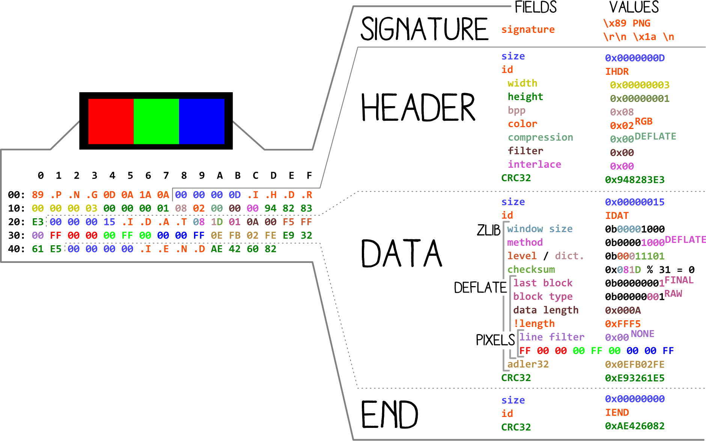

# PNG: [Portable Network Graphics](https://en.wikipedia.org/wiki/Portable_Network_Graphics) [PEE-en-JEE / PING]
extensions: png

# Documentation

Official:
- ISO Specs (10 November 2003): [Portable Network Graphics (PNG) Specification and Extensions](http://www.libpng.org/pub/png/spec/)
 - [Register of public PNG chunks](http://www.libpng.org/pub/png/spec/register/pngreg-1.4.6-pdg.html)

External: [ExifTools tag names](https://www.sno.phy.queensu.ca/~phil/exiftool/TagNames/PNG.htm)

Tools: [TweakPNG](http://entropymine.com/jason/tweakpng/), [OptiPNG](http://optipng.sourceforge.net/), [AdvComp](http://www.advancemame.it/download)

# Structure

(Probably the simplest structure in file formats)

 1. signature (8 bytes) at offset `0`: `\x89PNG\x0d\x0a\x1a\x0a` / `89 .P .N .G \r \n 1A \n` (1A = ^Z [EOF] / ␚ [substitute](https://en.wikipedia.org/wiki/Substitute_character))
 1. sequence of Length-Type-Value structures - `chunks` - ending with a checksum.
  - `length:>4u;` `type:4c;` `data:[length]b;` `crc32(type+data):4u;`
  - types are 4 letters:
  	- if the first letter is uppercase, the chunk is *critical*, otherwise it's *ancillary*.
 

Terminator: `00 00 00 00` `.I .E .N .D` `AE 42 60 82` (a valid `IEND` chunk)

CRC32 is zlib's CRC32.

A valid PNG is at least 3 chunks: `IHDR` `IDAT` `IEND`.

*Fig: a dissected [RGB png](rgb.png)*

# Chunk types

## Png Specifications 1.2 (ISO)

### critical

- `IHDR` Image header. required. must appear first.
- `PLTE` Palette. required *only* for indexed images. 
- `IDAT` Image data. required. must be consecutive. can be empty
- `IEND` Image trailer. must appear last. empty.

### ancillary

#### transparency information
- `tRNS` transparency

#### color space information
- `gAMA` image gamma
- `cHRM` primary chromaticities and white point
- `sRGB` standard RGB colour space
- `iCCP` embedded ICC profile
  - `zCCP` compressed Color Profile
- `sBIT` significant bits

#### textual information
- `tEXt` textual data
- `zTXt` compressed textual data
- `iTXt` international textual data

#### misc info
- `bKGD` background info
- `pHYs` physical pixel dimensions
- `sPLT` suggested palette
- `hIST` palette histogram
- `tIME` image last-modification time

## Extensions to the PNG 1.2 Specification

[version 1.4.0](http://www.libpng.org/pub/png/spec/register/pngext-1.4.0-pdg.html)

## PNGEXT 1.2.0
- `fRAc` Fractal image parameters

- `oFFs` Image offset                     - before IDAT

### Gif
- `gIFg` GIF Graphic Control Extension
- `gIFt` GIF Plain Text Extension (deprecated)
- `gIFx` GIF Application Extension

- `pCAL` Calibration of pixel values      - before IDAT
- `sCAL` Physical scale of image subject  - before IDAT

## PNGEXT 1.3.0
- `sTER` Indicator of Stereo Image        - before IDAT

## PNGEXT 1.4.0
- `dSIG` Digital Signature                - in pairs, immediately after IHDR and before IEND

## Exif
- `eXIf` EXIF - registered July 2017
- `zxIf` compressed EXIF

- `vpAg` VirtualPage - deprecated
 - `caNv` Canvas - superceding

## APNG
[APNG specifications](https://wiki.mozilla.org/APNG_Specification)

An APNG is a PNG, with 3 extra kinds of chunks while a MNG share the same structure, but has a different signature: `8A .M .N .G \r \n ^Z \n` and more chunks such `MHDR`, `MEND` and contains PNG images as frames...

- `acTL` AnimationControl
- `fcTL` Frame Control Chunk
- `fdAT` Frame Data Chunk

## MNG
[ImageMagic](https://github.com/ImageMagick/ImageMagick/blob/master/coders/png.c#L533)
- `orNT` orientation
- `nEED` need cache off
- `pHYg` ...

# Tricks
- CRC32 are usually ignored.
- the CRC32 of the last chunk may be absent.
- the `IHDR` / `Image Header` should theoretically be the first chunk, actually this is not enforced.
- the `IEND` / `Image End` chunk can be omitted.
- `PLTE` chunks are ignored if the image is not indexed.
- Any ancillary chunk (starting with a lowercase letter) can be inserted, as many times as necessary.
- Several `PLTE` / `Palette` chunks may be tolerated. Different tools may then use a different one, and render different colors accordingly.

# Addendum
- [Encoding Web Shells in PNG IDAT chunks](https://www.idontplaydarts.com/2012/06/encoding-web-shells-in-png-idat-chunks/)
